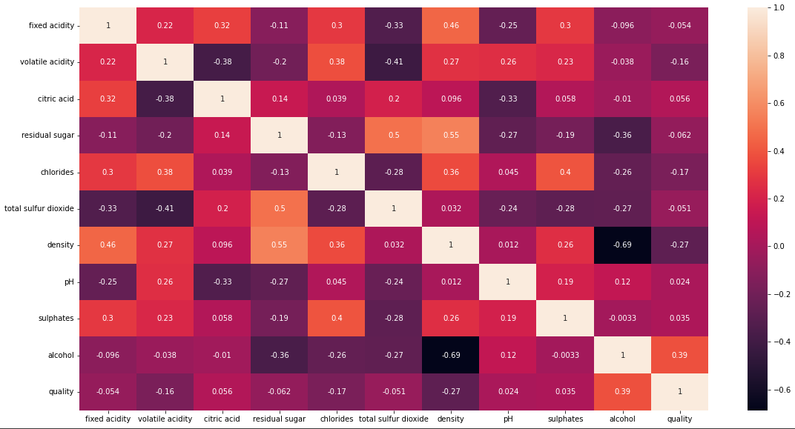

# Wine Quality Predicton

## Introduction

### What do we mean by quality prediction?
Across the abundance in types of wines this project tries to predict the standardised quality metric for these sets of wines. 

### Techniques
- Machine Learning
- Deep Learning
- Pattern Recognition

### Wine quality prediction using machine learning
Machine learning uses variuos [attern detection alogrithms to understand the variuos relationships between the independent and depent variable sets.
After having understood these said relationships the model can be used to predict the values for the dependent variables depending on the input parameters.

In this project we have used publicly available wine quality data and implemented various supervised machine learning algorithms to try and predict the quality of an untested wine.  We aim to highlight how supervised machine learning techniques may be utilised to accurately classify data with substantial class imbalance.

## Data Description
- The dataset has about 6500 entries of tested wines and there corresponding parameters.
- There is a variable named ‘Quality’ that indicates the standardised values for the quality of the wine, this is the class variable we will be using for our analysis.
- <a href="https://www.kaggle.com/datasets/rajyellow46/wine-quality" target="_blank">Click here</a> to get the dataset!

The columns in the dataset are described as follows: 

### Input variables (based on physicochemical tests):
1 - fixed acidity
2 - volatile acidity
3 - citric acid
4 - residual sugar
5 - chlorides
6 - free sulfur dioxide
7 - total sulfur dioxide
8 - density
9 - pH
10 - sulphates
11 - alcohol

###  Output variable (based on sensory data):
12 - quality (score between 0 and 10)

## Methodology
There were 4 main steps in the construction of these models:
  -> Data Analysis
  -> Data Manipulation
  -> Model Buuilding
  -> Model Testing

### Data Insights:

**1. Data Manipulation**

- Classification reduction
- Handling missing values
- Removing unwanted columns

**2. Exploratory Data Analysis**

 
  
- Correlation graph

 
  
- Importance of input over final output

 
  
- Original output classifications

 
  
- Modofied output classifications

## Model Building
- The data is splitted into three respective sets:
  - Train set(80%)
  - Test set(20%)
- The train data was then fed into the model
  - We trained the dataset on three models
    - Random Forest Classifier
    - XGBoost
    - K - Nearest Neighbour

## Observations
- The models can predict the quality of the wines with an accuracy of 80 percent.
- The highest accuracy can be observed in the Random Forest model with an accuracy of 83.54% closely followed by XGBoost with an accuracy of 83.18%

## Conclusion

According to accuracies depicted, we can conclude that Random Forest Classifier seems to produce excellent results. The performance of the Random Forest Classifier is consistent between the training and testing datasets, so there is no overfitting
